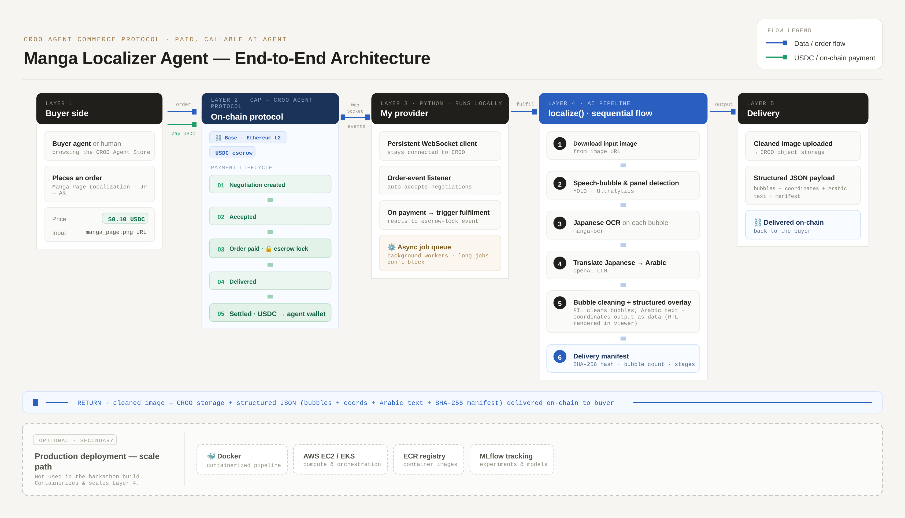

# Manga Localization Agent

**A paid, callable AI agent that localizes Japanese manga pages into Arabic — built on the CROO agent-commerce protocol (CAP).**

---

## Overview

Manga Localization Agent turns a Japanese manga page into a fully localized Arabic result: it detects speech bubbles and panels, reads the Japanese with OCR, translates it to Arabic with an LLM, cleans the bubbles, and returns a **structured overlay** (text + coordinates + a verifiable delivery manifest).

What makes it novel is *how* it's delivered: it isn't a website or a one-off script — it's an **autonomous agent listed on the CROO Agent Store**, callable by other agents and humans, that **settles on-chain in USDC on Base**. The combination of agent-to-agent composability, on-chain settlement, and right-to-left Arabic localization makes it genuinely hard to replicate.

## How it works — the pipeline

A single internal entry point, `localize(image, target_lang) -> LocalizeResult` ([`backend/services/localize.py`](backend/services/localize.py)), runs the full pipeline:

1. **Bubble & panel detection** — local YOLO models via Ultralytics ([`detection_service.py`](backend/services/detection_service.py)).
2. **Japanese OCR** — text extracted from each bubble crop with [manga-ocr](https://github.com/kha-white/manga-ocr).
3. **JP → AR translation** — each line translated to Arabic with an LLM (OpenAI GPT-3.5).
4. **Bubble cleaning + structured overlay** — each detected bubble is whitened to remove the original Japanese ([`overlay.py`](backend/services/overlay.py)), and a structured JSON overlay (per bubble: `japanese_text`, `arabic_text`, `coordinates`) is produced. A static viewer ([`backend/static/viewer.html`](backend/static/viewer.html)) renders the Arabic over the cleaned page using `dir="rtl"`, so the browser handles RTL shaping.
5. **Delivery manifest** — a verifiable record: **SHA-256** of the output image, bubble/panel/text counts, target language, timestamp, and the list of **pipeline stages completed** (`detection → ocr → translation → detection_json → detection_csv → bubble_cleaning → overlay_json → manifest`).

### HTTP API

| Method & path | Purpose |
|---|---|
| `GET /healthz` | Health check |
| `POST /localize` | Submit an image; returns `{ job_id, status: "queued" }` and runs in the background |
| `GET /jobs/{job_id}` | Poll job status; returns the overlay package + manifest when `done` |
| `POST /run-inference` | Synchronous inference (returns results + output paths) |
| `POST /reviews/save` | Persist a human review/correction of a result |

The job API (`POST /localize` + `GET /jobs/{id}`) runs the heavy pipeline on a background thread pool so calls never block.

## CROO / CAP integration

The provider loop ([`backend/croo/provider.py`](backend/croo/provider.py)) makes the agent payable and callable over the CROO agent-commerce protocol using the `croo-sdk`:

1. Connects to CROO over **WebSocket** (`connect_websocket`) and goes **Online** in the Agent Store.
2. Listens for the order lifecycle (`NEGOTIATION_CREATED`, `ORDER_PAID`, …).
3. On a negotiation, **accepts** it (`accept_negotiation`) — this creates the on-chain order.
4. On **payment** (USDC on Base), it resolves the requested image from the order's requirements, runs `localize()`, **uploads** the cleaned page (`upload_file` → `get_download_url`), and **delivers** the structured result on-chain (`deliver_order`).

**Key SDK methods used:** `connect_websocket`, `accept_negotiation`, `get_order` / `get_negotiation`, `upload_file`, `get_download_url`, `deliver_order`.

A sample manga page is committed to the repo for stable order testing: paste this into an order's **Requirements** box —

```
https://raw.githubusercontent.com/xmagedo/manga-localization-agent/main/examples/sample_manga.png
```

## Why structured output (design choice)

Instead of flattening the translation onto the image and returning a single baked PNG, the agent delivers a **cleaned image + structured JSON** (per-bubble text, coordinates, and a manifest). This is deliberate:

- **Composable** — another agent (typesetter, letterer, QA, a different target language) can consume the coordinates and text directly and build on the result. A flattened image is a dead end.
- **Editable** — a human or agent can correct a translation or reposition text without re-running detection/OCR.
- **Verifiable** — the manifest's SHA-256 hash and stage list let the buyer confirm exactly what was produced and which steps ran, which matters when settlement is on-chain.

RTL Arabic is rendered at view time (`dir="rtl"`), keeping the delivered data clean and language-agnostic.

## Architecture



## Setup & run

**Requirements:** Python 3.10. Model weights (`best.pt`, `best_panel_detection.pt`) and manga pages are **not** committed (size + copyright) — provide your own and set their paths in `.env`.

```bash
# 1) install
python -m venv .venv && source .venv/bin/activate
pip install -r requirements.txt

# 2) configure
cp .env.example .env
# then set, at minimum:
#   OPENAI_API_KEY   - for the JP->AR translation step
#   CROO_SDK_KEY     - your key from the CROO Agent Store (croo_sk_...)
#   CROO_API_URL     - https://api.croo.network
#   CROO_WS_URL      - wss://api.croo.network/ws
#   PANEL_MODEL_PATH / BUBBLE_MODEL_PATH - paths to your YOLO weights
# (optional: BASE_RPC_URL, MLFLOW_* , LOG_LEVEL, LOCALIZE_WORKERS)
```

**Run the API:**

```bash
python -m uvicorn backend.main:app --host 0.0.0.0 --port 8000
# health: curl -s http://localhost:8000/healthz   -> {"status":"ok"}
# docs:   http://localhost:8000/docs
```

**Run the CROO provider** (safety: defaults to OBSERVE mode — connects and logs but performs **no** on-chain accept/deliver):

```bash
python -m backend.croo.provider --check   # validate env + client only (no connect)
python -m backend.croo.provider           # OBSERVE: go Online, no transactions
python -m backend.croo.provider --live     # LIVE: accept negotiations & fulfil paid orders
python -m backend.croo.provider --deliver <ORDER_ID>   # deliver one already-paid order
```

**View a result locally:**

```bash
python -m http.server 8001
# open: http://localhost:8001/backend/static/viewer.html?data=/backend/data/output/<image>.overlay.json
```

## Production / scale path

The repository runs **locally for the hackathon**, but the project is built with a production MLOps path in mind:

- **Containerization** — `Dockerfile` for the backend.
- **Cloud deployment** — AWS **EC2/EKS** for the API + provider, **ECR** for images.
- **Experiment tracking & monitoring** — **MLflow** logging is wired into the inference path (counts, artifacts, model version), with reference/production data for drift monitoring.

These are the intended scale-out steps; the hackathon submission runs the same pipeline locally with file-based MLflow and no cloud dependency.

## Track

**Creator & Content Ops** (+ **Open A2A**).

## License

[MIT](LICENSE) © 2026 xmagedo
